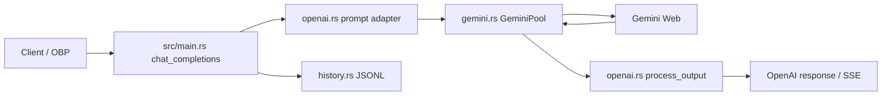
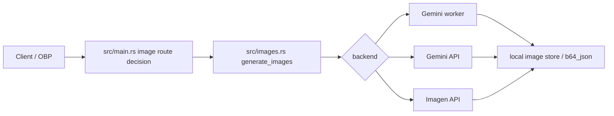
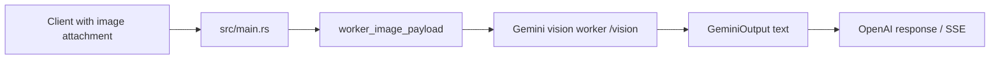

# Gemini-FastAPI Rust 架构设计

这份文档描述 `dev-rs` 分支的 Rust sidecar 架构。目标是让 nanobot/OBP 可以用一个低内存、可守护、OpenAI 兼容的 Gemini Web 网关，同时尽量保留和上游 Python 项目的同步空间。

## 架构原则

- **普通聊天优先稳定**：聊天路径不能被图片生成、OCR、worker 或 Web 工具状态污染。
- **高风险慢路径隔离**：生图和视觉识图走独立 seam，失败时应该有明确错误，不拖垮普通聊天。
- **运行配置不进仓库**：Cookie、API Key、worker token 只存在运行时配置或 secret 文件。
- **OBP 负责路由和账本**：Gemini-FastAPI 只做 Gemini Web/OpenAI 兼容适配，不实现完整模型网关。
- **上游兼容保留**：Python/FastAPI 原实现仍保留；Rust sidecar 是我们自己的低内存部署路径。

## 模块视图

| Module | 文件 | Interface | Implementation / Leverage |
| --- | --- | --- | --- |
| HTTP shell | `src/main.rs` | OpenAI compatible routes: `/health`、`/v1/models`、`/v1/chat/completions`、`/v1/responses`、`/v1/images/generations` | 负责认证、请求编排、SSE 输出、历史记录和错误转换 |
| Gemini Web adapter | `src/gemini.rs` | `GeminiPool::generate_output*`、模型发现、session refresh/warmup | 隐藏 Gemini Web RPC、Cookie、上传、临时对话、流式解析细节 |
| OpenAI protocol adapter | `src/openai.rs` | request/response 类型、prompt 转换、tool call 解析、token 估算 | 把 OpenAI/Responses 形态转成 Gemini 输入，再把 Gemini 输出转回兼容格式 |
| Request routing | `src/routing.rs` | `choose_generation_route`、`GenerationRoute`、严格生图意图判断 | 集中决定请求走普通 Gemini、vision worker 还是 image tool |
| Image generation adapter | `src/images.rs` | `generate_images` + `ImageGenerationConfig` | 根据 `backend` 分发到 Gemini Web worker、Gemini API、Imagen API 等后端 |
| Runtime config | `src/config.rs` | YAML + env path config structs | 提供运行时 seam；真实 secret 不落仓库 |
| History ledger | `src/history.rs` | `HistoryStore::append` | 用 JSONL 记录每次请求的 kind/model/latency/error，给 OBP/排障使用 |

## 关键 seam

### 1. Chat/Responses seam

入口在 `src/main.rs`：

- `chat_completions` 负责 OpenAI Chat Completions 协议。
- `create_response` 负责 OpenAI Responses 协议。

两者共享这些公共实现：

- `append_text_only_image_guard`：当图片后端关闭时，阻止 Gemini Web 自己谈“无法生图/未登录/地区不可用”。
- `src/routing.rs` 的 `choose_generation_route`：只看最新用户意图、附件和 worker 状态，决定进入普通 Gemini、vision worker 或 image tool。
- `record_history`：统一写入历史账本，避免每条路径重复构造 `HistoryRecord`。
- `usage_for`：统一 token usage 估算格式。

Chat/Responses 的“路由决策”已经提成 `src/routing.rs`。后续如果继续减少 `main.rs` 体积，优先提取 SSE chunk 构造，而不是先拆出很多只有一层转发的小函数。

### 2. Gemini Web adapter seam

`src/gemini.rs` 是最深的 Module。调用方只需要知道：

- 给定 model、prompt、attachments。
- 可以选择普通输出或带 progress 的输出。
- 失败时返回明确错误。

内部细节包括：

- Gemini Web init markers / token 提取。
- custom model header。
- temporary chat 标记。
- content-push 上传。
- StreamGenerate frame 解析。
- session refresh 和 warmup。

这个 Module 的深度是合理的：删除它不会消除复杂性，只会让 Gemini Web 逆向细节扩散到 HTTP 层。

### 3. Image / Vision seam

当前图片相关分两类：

- **生成图片**：`/v1/images/generations` 或显式生图 prompt，走 `src/images.rs` 的 `generate_images`；Gemini Web 生成图下载会优先尝试 `c8o8Fe` 全尺寸 RPC，失败再回落预览图 URL。
- **识图/OCR/视觉附件**：Chat/Responses 有附件时，如果配置了 worker，则走 `generate_vision_worker_output`。

设计约束：

- 普通聊天不应该因为文字里出现“图”“画面”“生图报错”就进入图片工具。
- worker token 推荐使用 `worker_token_file`，不要内联写进配置仓库。
- worker 是可替换 Adapter；当前 HTTP contract 是 `/image` 和 `/vision`。

### 4. History ledger seam

`record_history` 是 HTTP shell 里的公共入口，`HistoryStore` 只负责 append JSONL。这样做的好处：

- 调用方不再关心 timestamp、latency 和 record shape。
- 未来如果要增加 `trace_id`、`source`、`actual_model`，只改一个 seam。
- 排障日志的 kind 命名集中可见：`chat.completions`、`chat.completions.image_tool`、`chat.completions.vision_worker`、`responses.*`。

## 请求流程

### 普通聊天

### 显式生图

### 识图/OCR

## 当前已知技术债

1. `src/main.rs` 仍然偏大，但路由决策已经移出；下一步如果要继续瘦身，优先考虑 SSE chunk 构造。
2. SSE chunk 构造仍有重复。可以提一个 `chat_stream_chunk` Module，但要小心别让 Interface 反而比 Implementation 更复杂。
3. worker contract 目前是约定式 JSON，还没有独立类型。等 worker 稳定后可以把 request/response 类型放进 `src/images.rs`。
4. `gemini.rs` 很深但也很长。它是合理的深 Module，后续拆分要按 Gemini Web 子概念拆，比如 session、upload、frame parser，而不是机械按行数拆。

## 不做什么

- 不在这个仓库里管理 OBP 的路由、成本和来源统计。
- 不在示例配置里提交任何真实 Cookie、token 或 API key。
- 不为了“文件变小”而制造浅 Module；拆分必须提升 locality 或 leverage。
